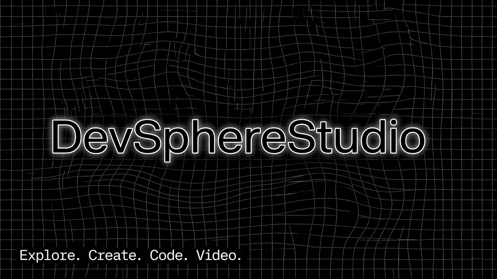

  

# Olá, eu sou o Bruno Oliveira 👋

Founder of **DevSphere-Studio**. Desenvolvedor Web e Editor de Vídeo focado em criar sites modernos e conteúdos digitais de alta qualidade.

### 🛠 Tecnologias & Ferramentas

### 📈 Estatísticas do meu GitHub

  

---
*"Transformando ideias em código e pixels."*

<picture>
  <source media="(prefers-color-scheme: dark)" srcset="https://raw.githubusercontent.com/platane/snk/output/github-contribution-grid-snake-dark.svg">
  <source media="(prefers-color-scheme: light)" srcset="https://raw.githubusercontent.com/platane/snk/output/github-contribution-grid-snake.svg">
  
</picture>
